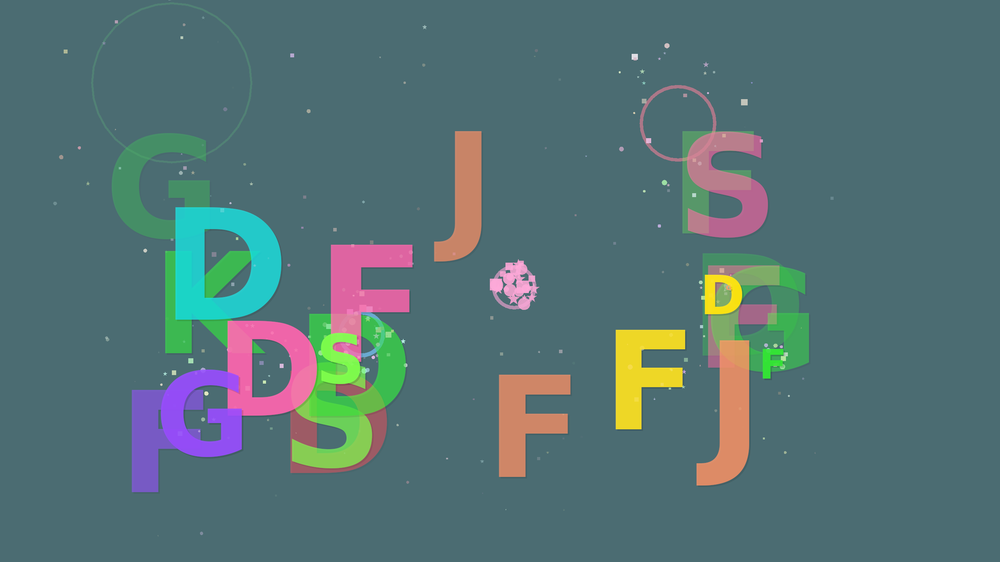

# bimbumbam

[](https://github.com/gdmsl/bimbumbam/actions/workflows/ci.yml)
[](#license)


> A toddler-friendly fullscreen keyboard basher for Wayland.



## Why this exists

My daughter kept reaching for the laptop and slapping at the keys
the moment I sat down to work. Closing the lid was no fun for her,
locking the screen no fun for either of us. I wanted **one thing I
could trigger from a window-manager keybind** that would (a) make my
machine fall silent to her input, (b) absolutely captivate her for a
few minutes, and (c) leave my desktop *exactly* as I left it the
moment we were done.

`bimbumbam` is that thing. One shortcut in niri (or Hyprland) and the
laptop becomes hers — a fullscreen overlay that turns every key into a
bright letter, a firework, a shockwave, a flying polygon. The
keyboard is fully grabbed: no Super+T launching a terminal, no
Alt+F4 closing my work, no accidental tab-switch into Slack. Three
seconds of `Ctrl+Alt+Q` later I'm back where I was.

It's also genuinely fun to look at, which is the whole point.

## How it feels

- One shortcut from your compositor and the screen turns into a
  playground. Every keystroke spawns something — letters, digits, a
  rainbow on Enter, a firework on Space.
- Per-key pentatonic notes via `rodio`, so any combination of mashed
  keys still sounds like music. Tunable with `--volume`, killable with
  `--mute`.
- The exit chord (`Ctrl+Alt+Q` for 3 s) requires the modifiers to be
  held *before* the Q goes down — a flat-handed slap doesn't trigger
  it. The hint re-appears at the bottom every 30 s so you never have
  to remember it.
- `Ctrl+Shift+S` starts a 3-second countdown then saves a PNG of the
  current canvas to `~/Pictures/`. Great for keeping the kid's
  "masterpieces" — the screenshot above is one of hers.

## Compositor support

`bimbumbam` lives on top of
[wlr-layer-shell](https://wayland.app/protocols/wlr-layer-shell-unstable-v1)
and (where available)
[`zwp_keyboard_shortcuts_inhibit_v1`](https://wayland.app/protocols/keyboard-shortcuts-inhibit-unstable-v1).

| Compositor          | layer-shell | shortcuts-inhibit | Notes                                          |
| ------------------- | :---------: | :---------------: | ---------------------------------------------- |
| **niri**            | yes         | yes               | What I use day-to-day.                         |
| **Sway**            | yes         | yes               | Full support.                                  |
| **Hyprland**        | yes         | partial           | Some hard-coded compositor binds may persist.  |
| **KDE Plasma 6**    | yes         | yes               | Full support.                                  |
| **River**           | yes         | yes               | Full support.                                  |
| **Wayfire**         | yes         | yes               | Full support.                                  |
| GNOME mutter        | **no**      | n/a               | Unsupported — no layer-shell.                  |

## Installation

### NixOS / Nix

```sh
# run once, no install
nix run github:gdmsl/bimbumbam

# install into the current-user profile
nix profile install github:gdmsl/bimbumbam

# build from a clone
nix build && ./result/bin/bimbumbam
```

The root `flake.nix` exposes `packages.default`, `apps.default`, and a
`devShells.default` with the Rust toolchain and every system library
pre-wired (Wayland, libxkbcommon, fontconfig, freetype, vulkan-loader,
ALSA). Reference it as a flake input from your NixOS or home-manager
configuration to add `bimbumbam` declaratively.

### Other Linux distributions

Build dependencies (Wayland, libxkbcommon, fontconfig + freetype,
Vulkan loader, ALSA development headers, and a Rust toolchain ≥ 1.85):

| Distro       | Package install                                                                              |
| ------------ | -------------------------------------------------------------------------------------------- |
| **Arch**     | `sudo pacman -S wayland libxkbcommon fontconfig vulkan-icd-loader alsa-lib pkgconf rustup`   |
| **Debian/Ubuntu** | `sudo apt install libwayland-dev libxkbcommon-dev libfontconfig-dev libfreetype-dev libvulkan-dev libasound2-dev pkg-config` |
| **Fedora**   | `sudo dnf install wayland-devel libxkbcommon-devel fontconfig-devel freetype-devel vulkan-loader-devel alsa-lib-devel pkgconf` |

Then:

```sh
cargo install --git https://github.com/gdmsl/bimbumbam --locked
bimbumbam
```

## Binding it from your compositor

The whole point is that you launch `bimbumbam` with one keystroke. Pick
something memorable that *isn't* easy to bash by accident — I use
`Mod+Shift+B` (B for *bimbumbam*).

### niri

In `~/.config/niri/config.kdl`, inside the `binds { … }` block:

```kdl
binds {
    Mod+Shift+B { spawn "bimbumbam"; }
}
```

If you launch `bimbumbam` declaratively (e.g. via the Nix flake or
home-manager), point `spawn` at the absolute path: `spawn "/home/you/.nix-profile/bin/bimbumbam"`.

### Hyprland

In `~/.config/hypr/hyprland.conf`:

```ini
bind = SUPER SHIFT, B, exec, bimbumbam
```

### Sway

```sway
bindsym $mod+Shift+b exec bimbumbam
```

### KDE Plasma 6

System Settings → Shortcuts → Custom Shortcuts → Edit → New →
Global Shortcut → Command/URL. Set the trigger to `Meta+Shift+B`
and the command to `bimbumbam`.

> ### A word on niri's `allow-inhibiting=false`
>
> niri honours `zwp_keyboard_shortcuts_inhibit_v1` by default, but a
> bind in your config marked `allow-inhibiting=false` will *always*
> fire — that's the escape hatch for remote-desktop / VM use cases.
> If you find a compositor shortcut leaking through while bimbumbam
> is up, check that bind. Run with `RUST_LOG=bimbumbam=info` to see
> exactly when the inhibitor activates and on which surface.

## Usage

```
bimbumbam [--mute] [--no-flash] [--volume FLOAT]
bimbumbam --help | --version
```

| Flag             | Effect                                                              |
| ---------------- | ------------------------------------------------------------------- |
| `--mute`         | Disable all sound.                                                  |
| `--no-flash`     | Disable the soft full-screen tints (calmer for sensitive viewers).  |
| `--volume FLOAT` | Volume multiplier in `[0.0, 1.0]` (default `1.0`).                  |

Logging is structured via [`tracing`](https://crates.io/crates/tracing).
Set `RUST_LOG=bimbumbam=debug` to follow surface lifecycle, key events
and renderer fall-backs; the default filter is `bimbumbam=info,warn`.
A panic hook routes panic payloads through the same layer.

### Controls

| Input          | Effect                                                          |
| -------------- | --------------------------------------------------------------- |
| Letters        | Big bouncy letter + particles + a pentatonic note               |
| Digits         | Big digit + particles                                           |
| Space          | Firework + soft flash                                           |
| Enter          | Rainbow shockwave + a small chime                               |
| Arrow keys     | Flying polygon                                                  |
| Anything else  | Random shape, spiral, or burst                                  |
| `Ctrl+Shift+S` | Start a 3 s countdown, then save a PNG to `~/Pictures/`         |
| `Ctrl+Alt+Q`   | Hold for 3 s to exit (modifiers must be down before Q)          |

### Saving a screenshot

Press **Ctrl + Shift + S**. A big `3 → 2 → 1 → smile!` overlay
counts you down; at zero `bimbumbam` captures the *clean* frame
(no overlays) of the canonical canvas, encodes it as PNG on a
background thread, and shows a `Saved → <path>` toast for ~2 s.
Files land in `$XDG_PICTURES_DIR`, `$HOME/Pictures` if it exists,
or the current working directory, named
`bimbumbam-<unix-timestamp>.png`.

### Exiting

Hold **Ctrl + Alt + Q** for **three seconds**. A red progress bar in
the top-right confirms the chord is being recognised. Releasing any
of the three keys resets the timer. The hint also re-fades in at the
bottom of the screen every 30 s.

## How it works

```
src/
├── color.rs       — palette, premultiplied alpha, HSL → RGB
├── particle.rs    — short-lived sprite physics
├── effect.rs      — high-level effects + spawn routines
├── render.rs      — CPU-side draw batching + frame composition
├── text.rs        — glyphon wrapper
├── gpu.rs         — wgpu pipeline, per-frame render, screenshot capture
├── audio.rs       — rodio-backed pentatonic synth
├── keys.rs        — keysym classification + exit-gate state machine
├── screenshot.rs  — countdown state, PNG encoding, save target
├── config.rs      — argv parsing
├── wayland.rs     — Wayland event loop, layer-shell, shortcuts-inhibit
├── lib.rs         — module declarations
└── main.rs        — entry point
```

The Wayland event loop is driven by
[`calloop`](https://crates.io/crates/calloop) with a 16 ms timer that
calls `App::tick`. Each tick advances the simulation, builds geometry
into a single `DrawBatch`, and renders it once per output (zoom-fit).
The GPU pipeline is one shader, one render pass per surface,
premultiplied-alpha "over" compositing. Screenshot capture re-renders
the same geometry to an offscreen texture and reads it back through a
mapped buffer.

## Development

```sh
cargo test            # 44 unit tests covering pure logic
cargo clippy --all-targets -- -D warnings
cargo fmt --check
cargo run             # inside a Wayland session
```

CI runs the full suite on every push (see `.github/workflows/ci.yml`).

## Releasing

1. Bump `version` in `Cargo.toml`.
2. Move the `## [Unreleased]` block at the top of `CHANGELOG.md` under
   a new versioned heading and update the date.
3. Commit and tag: `git tag -s vX.Y.Z -m "vX.Y.Z"`.
4. Push: `git push --follow-tags`. The release workflow builds the
   binary, uploads a tarball, and generates release notes.

## Contributing

See [`CONTRIBUTING.md`](CONTRIBUTING.md) for the dev loop,
commit-message conventions, and the AI-assistance disclosure rule.

## License

Released under the [MIT license](LICENSE).

Unless you explicitly state otherwise, any contribution intentionally
submitted for inclusion in this project shall be licensed as above,
without any additional terms or conditions.
